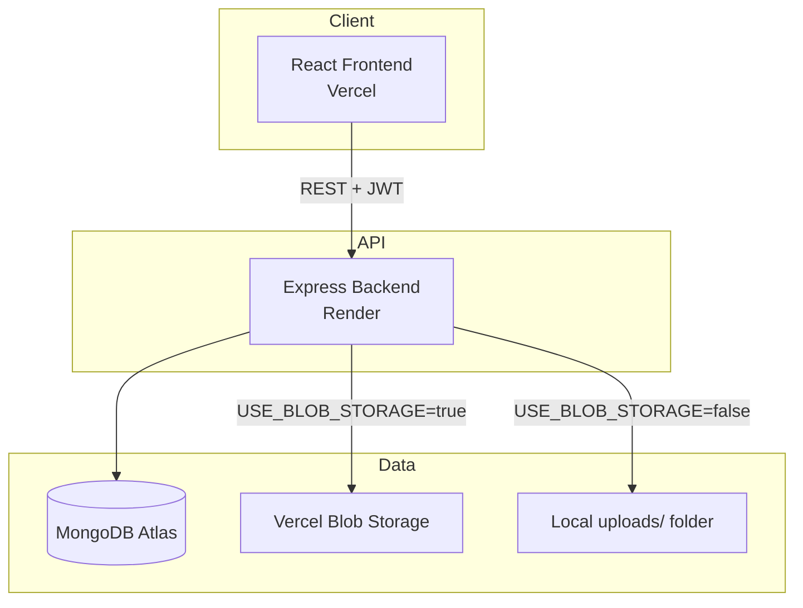

# ProfileVault

ProfileVault is a full-stack web application for securely managing user profiles, personal information, supporting documents, and downloadable profile documents (PDF and DOCX).

Users can register, authenticate, maintain a personal profile, upload supporting files, and generate documents containing their profile details. The project follows a modular monorepo architecture with a React frontend and an Express API backed by MongoDB Atlas.

[](https://drive.google.com/file/d/1-oEHCYG-3ZSojPHn3k-mTkj2NTujz1Nv/view?usp=sharing)

---

## Live Deployment

| Service   | Platform | URL |
|-----------|----------|-----|
| Frontend  | Vercel   | [https://profile-vault-black.vercel.app/login](https://profile-vault-black.vercel.app/login) |
| Backend   | Render   | [https://profilevault.onrender.com](https://profilevault.onrender.com) |
| File Blob | Vercel Blob Storage | Used by the backend when `USE_BLOB_STORAGE=true` |

**Health check:** `GET https://profilevault.onrender.com/health`

---

## Application Demo Video

A complete walkthrough of the application is available here:

🎥 **Demo Video:**  
https://drive.google.com/file/d/1-oEHCYG-3ZSojPHn3k-mTkj2NTujz1Nv/view?usp=sharing

The video demonstrates:
- User Registration & Login
- Profile Management
- Document Upload & Storage
- PDF/DOCX Generation
- Authentication & Protected Routes
- End-to-End Application Workflow

## Features

### Authentication
- Self-registration with username and password
- JWT-based login with access and refresh tokens
- Protected routes on both frontend and backend
- Change password (redirects to login after success)
- Logout with session invalidation

### Profile Management
- Create, view, and update personal details:
  - Full Name
  - Date of Birth
  - Email Address
  - Mobile Number
  - Address

### File Upload
- Upload supporting documents (JPG, PNG, PDF)
- File type and size validation (max 5 MB)
- Metadata stored in MongoDB; files stored locally or on Vercel Blob
- Image preview and file download in the UI

### Document Generation
- Download profile details as **PDF** or **DOCX**
- Generated from the authenticated user's profile data

### Dashboard
- Profile summary overview
- Uploaded documents list
- Quick actions (edit profile, upload, download documents, change password, logout)

---

## Tech Stack

### Frontend
| Tool | Purpose |
|------|---------|
| [React 19](https://react.dev/) | UI library |
| [Vite](https://vitejs.dev/) | Build tool and dev server |
| [TypeScript](https://www.typescriptlang.org/) | Type safety |
| [React Router DOM](https://reactrouter.com/) | Client-side routing |
| [TanStack Query](https://tanstack.com/query) | Server state and caching |
| [Axios](https://axios-http.com/) | HTTP client with JWT interceptors |
| [React Hook Form](https://react-hook-form.com/) | Form handling |
| [Zod](https://zod.dev/) | Schema validation |
| [Tailwind CSS](https://tailwindcss.com/) | Utility-first styling |
| [shadcn/ui](https://ui.shadcn.com/) + [Radix UI](https://www.radix-ui.com/) | UI components |
| [Sonner](https://sonner.emilkowal.ski/) | Toast notifications |
| [Lucide React](https://lucide.dev/) | Icons |

### Backend
| Tool | Purpose |
|------|---------|
| [Node.js](https://nodejs.org/) | Runtime |
| [Express.js](https://expressjs.com/) | REST API framework |
| [TypeScript](https://www.typescriptlang.org/) | Type safety |
| [MongoDB Atlas](https://www.mongodb.com/atlas) | Cloud database |
| [Mongoose](https://mongoosejs.com/) | ODM for MongoDB |
| [Zod](https://zod.dev/) | Request validation |
| [bcryptjs](https://www.npmjs.com/package/bcryptjs) | Password hashing |
| [jsonwebtoken](https://www.npmjs.com/package/jsonwebtoken) | JWT auth |
| [Multer](https://www.npmjs.com/package/multer) | Multipart file uploads |
| [PDFKit](https://pdfkit.org/) | PDF generation |
| [docx](https://www.npmjs.com/package/docx) | Word document generation |
| [@vercel/blob](https://vercel.com/docs/storage/vercel-blob) | Blob storage provider |
| [Winston](https://github.com/winstonjs/winston) | Application logging |
| [Morgan](https://www.npmjs.com/package/morgan) | HTTP request logging |
| [Helmet](https://helmetjs.github.io/) | Security headers |
| [CORS](https://www.npmjs.com/package/cors) | Cross-origin resource sharing |

### Deployment & Infrastructure
| Service | Role |
|---------|------|
| **Vercel** | Frontend hosting (SPA with client-side routing) |
| **Render** | Backend API hosting |
| **MongoDB Atlas** | Database |
| **Vercel Blob** | Production file storage |

---

## Architecture

### High-Level Flow



### Authentication Flow

1. User registers or logs in via `/api/auth/register` or `/api/auth/login`.
2. Backend returns an **access token** (short-lived) and **refresh token** (long-lived).
3. Frontend stores tokens in `localStorage` and attaches the access token as `Authorization: Bearer <token>` on every API request.
4. On `401`, the Axios interceptor automatically refreshes the access token via `/api/auth/refresh`.
5. Protected backend routes use JWT middleware; protected frontend routes use `ProtectedRoute`.

### Storage Architecture

File storage is abstracted behind a `StorageProvider` interface. The active provider is selected via environment variable — no business logic changes when switching.

| Mode | Env Variable | Storage Location |
|------|--------------|------------------|
| Local | `USE_BLOB_STORAGE=false` | `Backend/uploads/` on disk |
| Blob  | `USE_BLOB_STORAGE=true`  | Vercel Blob (requires `BLOB_READ_WRITE_TOKEN`) |

Uploaded file **metadata** (name, MIME type, size, URL, storage type) is always stored in the user's Profile document in MongoDB.

### Validation Strategy

Validation exists at two levels:
- **Frontend:** React Hook Form + Zod (UX and immediate feedback)
- **Backend:** Zod middleware (source of truth — never trust client input alone)

### Logging

| Logger | Output |
|--------|--------|
| Morgan | HTTP request logs → `Backend/logs/` |
| Winston | App, error, and warning logs → `Backend/logs/` |

---

## Repository Structure

```
ProfileVault/
├── Frontend/                  # React SPA (Vite + TypeScript)
│   ├── public/
│   ├── src/
│   │   ├── components/
│   │   │   ├── auth/          # ProtectedRoute, GuestRoute
│   │   │   ├── dashboard/     # Dashboard widgets
│   │   │   ├── layout/        # AppLayout, AuthLayout
│   │   │   ├── profile/       # Profile form, upload, downloads
│   │   │   └── ui/            # shadcn/ui components
│   │   ├── config/            # Environment config
│   │   ├── constants/
│   │   ├── lib/               # api-client, auth-storage, utils
│   │   ├── pages/             # Route pages
│   │   ├── providers/         # Auth, Query, Theme providers
│   │   ├── routes/            # React Router config
│   │   ├── services/          # API service layer
│   │   ├── types/
│   │   └── validations/       # Zod schemas
│   ├── .env.example
│   ├── vercel.json            # SPA rewrite rules
│   └── package.json
│
├── Backend/                   # Express API (TypeScript)
│   ├── src/
│   │   ├── config/            # env, database, logger, multer
│   │   ├── constants/
│   │   ├── middlewares/       # auth, validate, error handling
│   │   ├── modules/
│   │   │   ├── auth/          # Register, login, logout, change password
│   │   │   ├── profile/       # Profile CRUD
│   │   │   ├── upload/        # File upload
│   │   │   ├── document/      # PDF & DOCX generation
│   │   │   ├── health/        # Health check
│   │   │   └── user/          # User model
│   │   ├── services/
│   │   │   ├── storage/       # Local & Blob storage providers
│   │   │   └── document/      # PDF & DOCX generators
│   │   └── utils/
│   ├── scripts/               # Verification scripts (auth, upload, etc.)
│   ├── uploads/               # Local file storage (dev)
│   ├── logs/                  # Application logs
│   ├── .env.example
│   └── package.json
│
└── Project_Requirements_Development_Plan.md
```

---

## Database Design

**Database name:** `profile_vault`

### Users Collection

| Field | Type | Notes |
|-------|------|-------|
| `username` | String | Required, unique, lowercase, 3–30 chars |
| `password` | String | Required, bcrypt hashed, not returned in JSON |
| `isActive` | Boolean | Default `true` |
| `lastLoginAt` | Date | Updated on login |
| `tokenVersion` | Number | Used to invalidate sessions |
| `refreshTokenHash` | String | Hashed refresh token |
| `createdAt` / `updatedAt` | Date | Auto-managed timestamps |

### Profiles Collection

| Field | Type | Notes |
|-------|------|-------|
| `userId` | ObjectId | Required, unique, ref → User |
| `fullName` | String | Required |
| `dob` | Date | Required, cannot be in the future |
| `email` | String | Required, unique |
| `mobile` | String | Required, 10–15 digits |
| `address` | String | Required |
| `documents` | Array | Embedded document sub-schema |
| `createdAt` / `updatedAt` | Date | Auto-managed timestamps |

### Document Sub-Schema (embedded in Profile)

| Field | Type | Notes |
|-------|------|-------|
| `storageType` | String | `local` or `blob` |
| `originalName` | String | Original filename |
| `mimeType` | String | `image/jpeg`, `image/png`, `application/pdf` |
| `size` | Number | Max 5 MB |
| `url` | String | Public or local file URL |
| `uploadedAt` | Date | Upload timestamp |

---

## API Reference

All protected endpoints require:

```
Authorization: Bearer <access_token>
```

Responses follow a standard shape:

```json
{ "success": true, "data": { ... }, "message": "..." }
{ "success": false, "message": "Error description", "errors": { ... } }
```

### Health

| Method | Endpoint | Auth | Description |
|--------|----------|------|-------------|
| GET | `/health` | No | Server health check |

### Authentication — `/api/auth`

| Method | Endpoint | Auth | Description |
|--------|----------|------|-------------|
| POST | `/register` | No | Create a new user account |
| POST | `/login` | No | Authenticate and receive tokens |
| POST | `/refresh` | No | Refresh access token |
| GET | `/me` | Yes | Get current user |
| POST | `/logout` | Yes | Invalidate session |
| PUT | `/change-password` | Yes | Change password |

### Profile — `/api/profile`

| Method | Endpoint | Auth | Description |
|--------|----------|------|-------------|
| POST | `/` | Yes | Create profile |
| GET | `/` | Yes | Get current user's profile |
| PUT | `/` | Yes | Update profile |

### Upload — `/api/upload`

| Method | Endpoint | Auth | Description |
|--------|----------|------|-------------|
| POST | `/` | Yes | Upload a file (multipart/form-data, field: `file`) |

**Constraints:** JPG, PNG, PDF only · Max 5 MB

### Documents — `/api/documents`

| Method | Endpoint | Auth | Description |
|--------|----------|------|-------------|
| GET | `/pdf` | Yes | Download profile as PDF |
| GET | `/docx` | Yes | Download profile as DOCX |

---

## Local Development Setup

### Prerequisites

- [Node.js](https://nodejs.org/) 18+ (20+ recommended)
- [npm](https://www.npmjs.com/)
- MongoDB Atlas cluster (or local MongoDB instance)
- (Optional) Vercel Blob token for blob storage testing

### 1. Clone the repository

```bash
git clone <repository-url>
cd ProfileVault
```

### 2. Backend setup

```bash
cd Backend
npm install
cp .env.example .env
```

Edit `Backend/.env`:

```env
PORT=5000
NODE_ENV=development

MONGODB_URI=mongodb+srv://<user>:<password>@cluster.mongodb.net/profile_vault
JWT_SECRET=your_strong_secret_here
JWT_ACCESS_EXPIRES_IN=15m
JWT_REFRESH_EXPIRES_IN=7d

USE_BLOB_STORAGE=false
BLOB_READ_WRITE_TOKEN=

CLIENT_URL=http://localhost:5173
```

Start the backend:

```bash
npm run dev
```

The API runs at **http://localhost:5000**.

#### Backend verification scripts

```bash
npm run verify:database   # Test MongoDB connection
npm run verify:storage    # Test storage provider
npm run verify:auth       # Test auth endpoints
npm run verify:profile    # Test profile CRUD
npm run verify:upload     # Test file upload
```

### 3. Frontend setup

```bash
cd Frontend
npm install
cp .env.example .env
```

Edit `Frontend/.env`:

```env
VITE_API_URL=http://localhost:5000
```

Start the frontend:

```bash
npm run dev
```

The app runs at **http://localhost:5173**.

### 4. Build for production (local)

```bash
# Backend
cd Backend
npm run build
npm start

# Frontend
cd Frontend
npm run build
npm run preview
```

---

## Environment Variables

### Backend (`Backend/.env`)

| Variable | Required | Description |
|----------|----------|-------------|
| `PORT` | No | Server port (default: `5000`) |
| `NODE_ENV` | No | `development` or `production` |
| `MONGODB_URI` | **Yes** | MongoDB Atlas connection string |
| `JWT_SECRET` | **Yes** | Secret for signing JWTs |
| `JWT_ACCESS_EXPIRES_IN` | No | Access token TTL (default: `15m`) |
| `JWT_REFRESH_EXPIRES_IN` | No | Refresh token TTL (default: `7d`) |
| `USE_BLOB_STORAGE` | No | `true` for Vercel Blob, `false` for local disk |
| `BLOB_READ_WRITE_TOKEN` | When blob enabled | Vercel Blob read/write token |
| `CLIENT_URL` | No | Frontend origin for CORS (default: `http://localhost:5173`) |

### Frontend (`Frontend/.env`)

| Variable | Required | Description |
|----------|----------|-------------|
| `VITE_API_URL` | **Yes** | Backend API base URL |

---

## Deployment

### Frontend — Vercel

1. Import the repository on [Vercel](https://vercel.com/).
2. Set **Root Directory** to `Frontend`.
3. Build settings (auto-detected for Vite):
   - **Build command:** `npm run build`
   - **Output directory:** `dist`
4. Add environment variable:

   ```
   VITE_API_URL=https://profilevault.onrender.com
   ```

5. Deploy. The `vercel.json` rewrite rule ensures all routes serve `index.html` for client-side routing.

**Live URL:** [https://profile-vault-black.vercel.app/login](https://profile-vault-black.vercel.app/login)

### Backend — Render

1. Create a new **Web Service** on [Render](https://render.com/).
2. Connect the repository and set **Root Directory** to `Backend`.
3. Configure:
   - **Build command:** `npm install && npm run build`
   - **Start command:** `npm start`
   - **Runtime:** Node
4. Add environment variables:

   ```
   NODE_ENV=production
   MONGODB_URI=<your-atlas-uri>
   JWT_SECRET=<strong-secret>
   JWT_ACCESS_EXPIRES_IN=15m
   JWT_REFRESH_EXPIRES_IN=7d
   USE_BLOB_STORAGE=true
   BLOB_READ_WRITE_TOKEN=<vercel-blob-token>
   CLIENT_URL=https://profile-vault-black.vercel.app
   ```

5. Deploy.

**Live URL:** [https://profilevault.onrender.com](https://profilevault.onrender.com)

> **Note:** Render free-tier services spin down after inactivity. The first request after idle may take 30–60 seconds to respond.

### File Storage — Vercel Blob

Production uses Vercel Blob for uploaded files:

1. Create a Blob store in the [Vercel dashboard](https://vercel.com/dashboard) → Storage → Blob.
2. Copy the **Read/Write token** into the backend's `BLOB_READ_WRITE_TOKEN` on Render.
3. Set `USE_BLOB_STORAGE=true` on the backend.

Local development typically uses `USE_BLOB_STORAGE=false` and the `Backend/uploads/` folder.

### MongoDB Atlas

1. Create a free cluster at [MongoDB Atlas](https://www.mongodb.com/atlas).
2. Create database `profile_vault`.
3. Add your IP (or `0.0.0.0/0` for cloud deployments) to the network access list.
4. Create a database user and copy the connection string into `MONGODB_URI`.

---

## Frontend Routes

| Path | Access | Page |
|------|--------|------|
| `/` | Protected | Redirects to `/dashboard` |
| `/login` | Guest only | Sign in |
| `/register` | Guest only | Create account |
| `/dashboard` | Protected | Dashboard overview |
| `/profile` | Protected | Profile management, uploads, downloads |
| `*` | Public | 404 Not Found |

---

## Security

- Passwords hashed with **bcryptjs** — never stored in plain text
- **JWT** access + refresh token rotation with token versioning
- **Helmet** security headers on all API responses
- **CORS** restricted to the configured `CLIENT_URL`
- **Zod** validation on all request bodies (backend)
- File type whitelist and 5 MB size limit on uploads
- Protected routes require valid JWT on both client and server
- Session cleared and user redirected to login after password change

---

## Development Principles

- **Monorepo** with separate `Frontend/` and `Backend/` packages
- **Feature-based modules** on the backend (`auth`, `profile`, `upload`, `document`)
- **Service layer** abstraction for storage and document generation
- **Centralized error handling** with standardized API responses
- **Separation of concerns** — controllers, services, validations, and models are isolated
- Backend APIs developed and verified before frontend integration

---

## License

ISC
